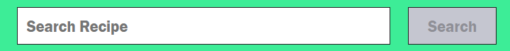
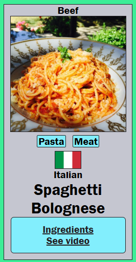
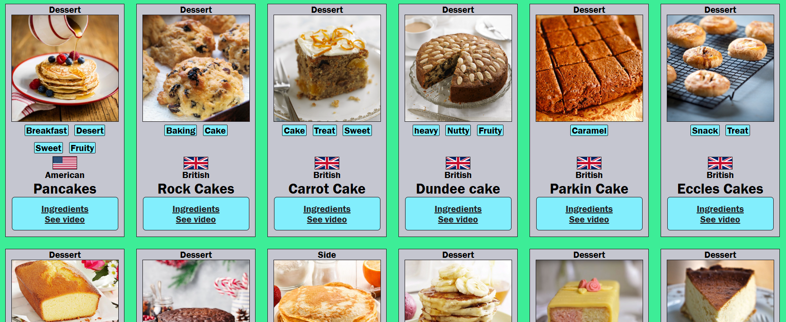

# Food Recipe Search

## About The Project
This project lets users search for a word and find a list of dishes associated with the word. These recipes come from around the world and offer a variety of dishes. So whether you're looking for something you're familiar with or find something new that piques your interest, this application will help in your search.

After learning HTML, CSS, and JavaScript, the next step was to learn react. As someone who wants to learn more about cooking, I was inspired to make a project that could quickly refer to instructions and tutorials for dishes. Finding the right API took some time, but when I found TheMealDb and learned enough about react, I was eager to make this project a reality.

I handled creating components and rendering cards fairly well, but I encountered some challenges when making the search bar, particularly making sense of the various react hooks, and the different file structure compared that react has. However, making sense of how hooks work and when they are used for brought clarity to this project. This experience was a fun one, and working on this project has made me comfortable using react in the future.

### Built With
- HTML5
- CSS3
- JavaScript
- React

## Usage
This project features one text field for a word. You can search for either a specific dish or a generic word such as 'cake' or 'chicken.' To submit searches, hit the 'Search' button.

Searching for a dish will return a maximum of twenty-five entries, depending on how many dishes match with your search. Each recipe card will return the following information:
- Dish category
- Dish thumbnail
- Associated tags
- Region of origin
- Dish name
- Link to recipe and list of ingredients provided by TheMealDb
- Link to a YouTube tutorial

As mentioned, this application can return several entries depending on what recipies TheMealDb contain. For instance, searching 'cake' will return twenty-five dishes.

A search will not display a valid result when:
- The word field is empty
- TheMealDb does not have data that contain the searched word in any dish

## Credits
- [Albert Devshot's Food Recipe App](https://www.youtube.com/watch?v=3kFSr-u6Uls&t=647s "YouTube") : For inspiration and help with the searchbar 
- [TheMealDb](https://www.themealdb.com/ "TheMealDb") : API used to fetch results
- [GitHub Pages](https://pages.github.com/ "GitHub Pages") : Used to host project online
- [Font Awesome](https://fontawesome.com/ "Font Awesome") : Used for icons in the footer
- [PedroTech's How to Deploy A React App To Github Pages](https://www.youtube.com/watch?v=Q9n2mLqXFpU "YouTube") : For help publishing on GitHub

## (The following was generated when setting up this project)

# Getting Started with Create React App

This project was bootstrapped with [Create React App](https://github.com/facebook/create-react-app).

## Available Scripts

In the project directory, you can run:

### `npm start`

Runs the app in the development mode.\
Open [http://localhost:3000](http://localhost:3000) to view it in your browser.

The page will reload when you make changes.\
You may also see any lint errors in the console.

### `npm test`

Launches the test runner in the interactive watch mode.\
See the section about [running tests](https://facebook.github.io/create-react-app/docs/running-tests) for more information.

### `npm run build`

Builds the app for production to the `build` folder.\
It correctly bundles React in production mode and optimizes the build for the best performance.

The build is minified and the filenames include the hashes.\
Your app is ready to be deployed!

See the section about [deployment](https://facebook.github.io/create-react-app/docs/deployment) for more information.

### `npm run eject`

**Note: this is a one-way operation. Once you `eject`, you can't go back!**

If you aren't satisfied with the build tool and configuration choices, you can `eject` at any time. This command will remove the single build dependency from your project.

Instead, it will copy all the configuration files and the transitive dependencies (webpack, Babel, ESLint, etc) right into your project so you have full control over them. All of the commands except `eject` will still work, but they will point to the copied scripts so you can tweak them. At this point you're on your own.

You don't have to ever use `eject`. The curated feature set is suitable for small and middle deployments, and you shouldn't feel obligated to use this feature. However we understand that this tool wouldn't be useful if you couldn't customize it when you are ready for it.

## Learn More

You can learn more in the [Create React App documentation](https://facebook.github.io/create-react-app/docs/getting-started).

To learn React, check out the [React documentation](https://reactjs.org/).

### Code Splitting

This section has moved here: [https://facebook.github.io/create-react-app/docs/code-splitting](https://facebook.github.io/create-react-app/docs/code-splitting)

### Analyzing the Bundle Size

This section has moved here: [https://facebook.github.io/create-react-app/docs/analyzing-the-bundle-size](https://facebook.github.io/create-react-app/docs/analyzing-the-bundle-size)

### Making a Progressive Web App

This section has moved here: [https://facebook.github.io/create-react-app/docs/making-a-progressive-web-app](https://facebook.github.io/create-react-app/docs/making-a-progressive-web-app)

### Advanced Configuration

This section has moved here: [https://facebook.github.io/create-react-app/docs/advanced-configuration](https://facebook.github.io/create-react-app/docs/advanced-configuration)

### Deployment

This section has moved here: [https://facebook.github.io/create-react-app/docs/deployment](https://facebook.github.io/create-react-app/docs/deployment)

### `npm run build` fails to minify

This section has moved here: [https://facebook.github.io/create-react-app/docs/troubleshooting#npm-run-build-fails-to-minify](https://facebook.github.io/create-react-app/docs/troubleshooting#npm-run-build-fails-to-minify)
